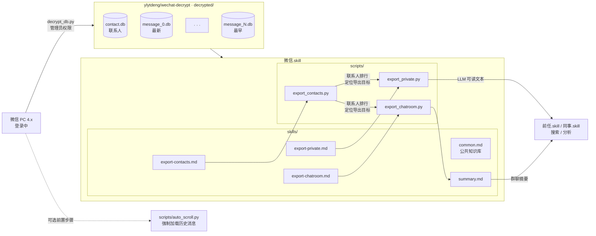

<div align="center">

# 微信.skill

[](LICENSE)
[](https://python.org)
[](https://claude.ai)
[](https://weixin.qq.com)

<br>

**前任.skill、同事.skill 的原料来自哪里——这就是答案。**

*微信聊天记录 → 解密 → LLM 可读文本，全程 Claude-native，零中间步骤。*

</div>

---

## 为什么需要这个

前任.skill、同事.skill 这类人物 skill 的核心操作是：**将你和某人的全部聊天记录喂给 Claude**，让它合成一个能模仿该人说话方式的 AI 人格。但在这一步之前，有一道真实的技术门槛：

**微信聊天记录不是一个可以直接读的文件。**

即便完成解密，你面对的仍然是：

- 每个联系人单独一张表，表名是 `Msg_` + MD5(wxid)，需要手动计算
- 同一联系人的消息可能分散在 message_0.db 到 message_N.db 等多个数据库
- 群聊发送者 ID 不在专用字段里，而是嵌在消息正文前缀 `wxid_xxx:\n` 中
- 引用回复、链接分享等扩展消息是 zstd 压缩的 XML，`local_type` 使用 `inner_type × 2³² + 49` 的编码规律
- 系统通知（撤回等）部分是完整 zstd 帧，部分是 zstd 帧头后直接拼接明文 XML

**微信.skill 把这一切全部处理掉，输出 Claude 可以直接读的压缩文本。**

WeChatMsg、PyWxDump 等工具走的是独立导出管道——和 Claude 之间还隔着格式转换步骤。微信.skill 是唯一完全 Claude-native 的实现：一个 Claude skill，在 Claude Code 里直接用自然语言操作。

---

## 能做什么

**为人物 skill 提供原料**

```
你     ❯ 把我和张雪三年内的所有聊天导出来

Claude ❯ 已合并 message_2.db + message_1.db + message_0.db，
         2022-03-15 至 2025-04-01，共 8,203 条，按对话时段分段
         → output/chat_张雪.txt
```

输出的 `chat_张雪.txt` 直接作为前任.skill 的输入原料。

**找那条你记得但搜不到的消息**

```
你     ❯ 帮我找和李明的聊天，他说过"我不会走的"，大概是去年冬天

Claude ❯ 在 2024-12-07 找到一条：
         李明：我不会走的，别这样想
         上下文：你们在讨论异地的事
```

**整理一段关系的完整时间线**

```
你     ❯ 帮我找和前公司王总的所有消息，从加好友到最后一条

Claude ❯ 最早记录：2021-03-15（入职当天）
         最后一条：2025-01-20
         共 1,203 条，其中你发 612 条，对方发 591 条
```

**群聊总结**

```
你     ❯ 把这个群最近一周的消息导出来

Claude ❯ 已导出 2026-03-27 至 2026-04-03，共 847 条，涉及 23 位成员
```

> 支持文字、图片、语音、视频、表情、位置、通话、引用回复、链接/卡片分享、系统通知（撤回）。

---

## 与 wechat-decrypt 的关系

[ylytdeng/wechat-decrypt](https://github.com/ylytdeng/wechat-decrypt) 负责**解密**：从微信进程内存提取密钥，输出可读的 SQLite 文件。这是必要的前置步骤，本项目不重复造轮子。

**微信.skill 负责之后的一切**：把解密后的数据库接入 Claude，通过 skill 实现完全的 agent 化操作。

wechat-decrypt 已作为 git submodule 内置于本项目，无需单独安装。



---

## 怎么开始

**Step 0 — 克隆本项目**

```bash
git clone --recursive https://github.com/chengmarc/wechat-to-LLM
```

`--recursive` 会同时拉取内置的 wechat-decrypt submodule，无需单独安装。

**Step 1 — 解密数据库**

微信需保持登录，以管理员权限运行：

```bash
cd wechat-to-LLM/wechat-decrypt
pip install -r requirements.txt
python main.py decrypt
```

解密完成后，`decrypted/` 目录下会生成 `contact/contact.db` 和 `message/message_0.db`。

**Step 2 — 安装 Skill**

```bash
cp skills/common.md ~/.claude/skills/           # 公共知识库（必须）
cp skills/export-contacts.md ~/.claude/skills/ # 重要联系人扫描
cp skills/export-private.md ~/.claude/skills/  # 双人会话
cp skills/export-chatroom.md ~/.claude/skills/ # 群聊
cp skills/summary.md ~/.claude/skills/         # 群聊总结
```

完成。打开 Claude Code，直接用自然语言说你想做什么。

---

## 目录说明

| 目录 | 用途 |
|---|---|
| `backup/` | 存放 `wechat-decrypt` 生成的 `all_keys.json`（密钥备份）。**`all_keys.json` 包含数据库加密密钥，已加入 `.gitignore`，不会上传。** |
| `output/` | 导出脚本的默认输出目录，存放生成的聊天记录文本文件。内容已加入 `.gitignore`，不会上传。 |

**环境要求**：Windows + 微信 PC 4.x。wechat-decrypt 同时支持 Linux，暂不支持 macOS 和微信 3.x。

**依赖**：Python 3.10+，[zstandard](https://pypi.org/project/zstandard/)（`pip install zstandard`，用于解码引用回复和分享消息）。

---

## 技术栈

**使用本项目只需要 Claude Code。** 但构建它涉及以下技术——这些复杂性被封装在 skill 和脚本里，用户无需关心：

| 层 | 技术 | 用途 |
|---|---|---|
| 数据库 | SQLite | 读取解密后的 contact.db / message_N.db |
| 压缩 | zstd（zstandard） | 解压 appmsg 扩展消息（引用回复、链接分享等） |
| 解析 | XML（ElementTree） | 解析 appmsg XML、sysmsg 系统通知 |
| 哈希 | MD5（hashlib） | 计算联系人消息表名、判断引用消息发送方 |
| 脚本 | Python 3.10+ | 查询、过滤、格式化输出 |
| AI 接入 | Claude Code Skill | 自然语言操作的完整 agent 化封装 |

---

## 免责声明

本工具仅用于读取**你自己的**微信数据，请遵守相关法律法规，不要用于未经授权的数据访问。

---

<div align="center">

MIT License © [chengmarc](https://github.com/chengmarc)

*数据是你的。读它的权利也是你的。*

</div>
