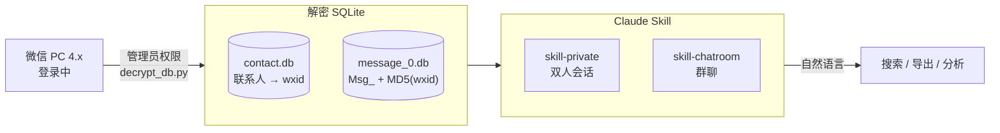

<div align="center">

# wechat-to-LLM

[](LICENSE)
[](https://python.org)
[](https://claude.ai)
[](https://weixin.qq.com)

<br>

*你和 TA 聊了三年，所有记录都在你电脑里，你却一条都搜不到。*

</div>

---

微信聊天记录是加密 SQLite，没有全局搜索，没有导出，每个联系人单独一张表，表名还要手动算。群聊更麻烦——发送者 ID 嵌在消息正文里，不在独立字段。

这两个 Claude Skill 把它接进 Claude，然后你用自然语言说话。

---

## Pipeline



---

## 能做什么

**找那条你记得但搜不到的消息**

```
你     ❯ 帮我找和李明的聊天，他说过"我不会走的"，大概是去年冬天

Claude ❯ 在 2024-12-07 找到一条：
         李明：我不会走的，别这样想
         上下文：你们在讨论异地的事
```

**整理一段关系的完整时间线**

```
你     ❯ 帮我找和前公司王总的所有消息，从加好友到最后一条

Claude ❯ 最早记录：2021-03-15（入职当天）
         最后一条：2025-01-20
         共 1,203 条，其中你发 612 条，对方发 591 条
```

**把一整年的对话导出给 AI 分析**

```
你     ❯ 把我和张雪 2023 年全年的聊天导出来

Claude ❯ 已导出 4,821 条消息，2023-01-03 至 2023-12-29
         按对话时段自动分段，直接可以送入 LLM
```

**群聊总结**

```
你     ❯ 把这个群最近一周的消息导出来

Claude ❯ 已导出 2026-03-27 至 2026-04-03，共 847 条，涉及 23 位成员
```

> 支持文字消息和系统通知（撤回、加好友）。图片、语音、视频暂不支持。

---

## 怎么开始

**Step 1 — 解密数据库**

依赖 [ylytdeng/wechat-decrypt](https://github.com/ylytdeng/wechat-decrypt)，微信需保持登录，需要管理员权限：

```bash
git clone https://github.com/ylytdeng/wechat-decrypt
cd wechat-decrypt && pip install -r requirements.txt
python decrypt_db.py
```

**Step 2 — 加载 Skill**

```bash
cp skills/skill-private.md ~/.claude/skills/   # 双人会话
cp skills/skill-chatroom.md ~/.claude/skills/  # 群聊
```

加载后直接用自然语言，不用记 SQL。完整操作步骤在 [`skills/`](skills/) 里。

**环境要求**：Windows + 微信 PC 4.x。暂不支持 macOS 和微信 3.x。

---

## 免责声明

本工具仅用于读取**你自己的**微信数据，请遵守相关法律法规，不要用于未经授权的数据访问。

---

<div align="center">

MIT License © [chengmarc](https://github.com/chengmarc)

*数据是你的。读它的权利也是你的。*

</div>
